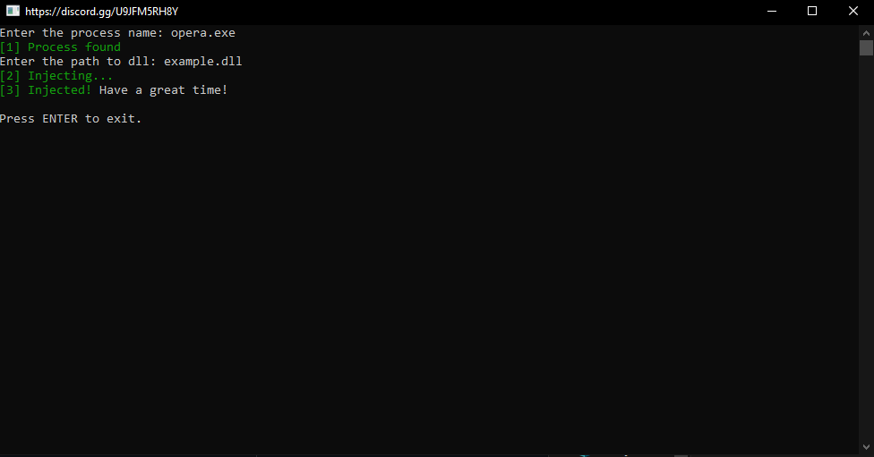
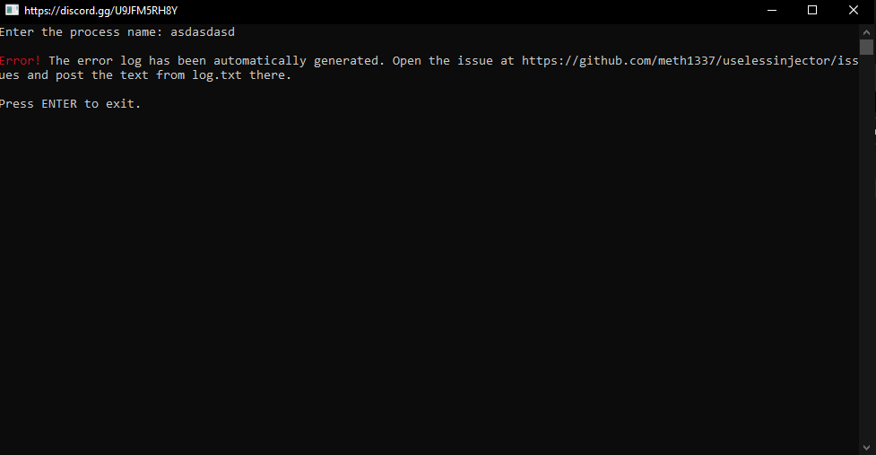

# uselessinjector
a dll injector written in python 3.11.0

## features
* automatic dll allocation
* injector
* generator of error log

### screenshots

---

---
# usage
* option 1 - download .exe for latest release [here](https://github.com/meth1337/uselessinjector/releases/latest)
* option 2 - `py injector.py`
